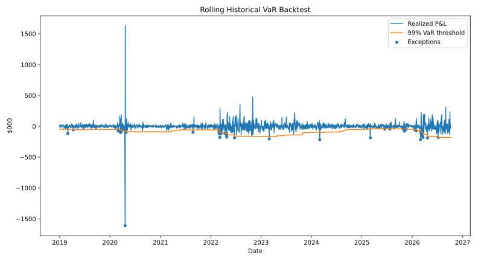

# Risk in a refiner’s 3-2-1 hedge book

How much can a refiner’s financial hedge lose in one day, and do the risk models recognize the same tail events?

**The saved public-data backtest misses the nominal 1% exception target.** Historical VaR is exceeded on 42 of 1,954 forecasts (2.15%); the Normal and weighted-history models each have 44 exceptions (2.25%). All three fail the saved 5% coverage and independence checks. That is a model/data limitation to investigate, not a validated risk forecast.

The first point to get right is the book’s direction: a refiner buys crude and sells products, so the financial margin hedge is **long crude and short products**. A loss on that hedge can offset a gain in the physical margin. This engine reports the financial hedge book; it does not call a hedge loss a loss for the entire refinery.

## The book

| Position | Contracts | Physical units |
|---|---:|---:|
| WTI crude (CL) | +30 | +30,000 bbl |
| RBOB gasoline (RB) | -20 | -840,000 gal = -20,000 bbl |
| Heating oil / distillate proxy (HO) | -10 | -420,000 gal = -10,000 bbl |

That is the hedge of a stylized 30,000-barrel crude input yielding 20,000 barrels of gasoline and 10,000 barrels of distillate. It is a benchmark crack hedge, not a refinery process model. Yields, quality, location, timing and operating costs remain outside the book.

## Results you can inspect

The [October 2026 sample](outputs/sample_run_2026-10/README.md) was run on public Yahoo continuous futures proxies with **2,205 aligned price observations through October 7, 2026**. Current risk uses the last 250 price changes. These numbers describe the financial hedge only.

| Method | 99% one-day VaR | Expected Shortfall |
|---|---:|---:|
| Historical | $181,399 | $195,300 |
| Normal | $161,159 | $184,634 |
| Student-t Monte Carlo | $175,837 | $222,113 |
| Weighted historical | $128,292 | $162,354 |

[Backtest exceptions](outputs/sample_run_2026-10/var_backtest_summary.csv) · [Stress results](outputs/sample_run_2026-10/hypothetical_stress_scenarios.csv) · [Executive summary](outputs/sample_run_2026-10/executive_summary.md)



The product-rally stress loses about $931,652 on the hedge while the matched physical margin gains. A limit status of “OK” only means the illustrative $500,000 VaR threshold was not breached; it does not mean the model passed validation.

The sample contains exact price inputs, configuration, environment and input checksum. It is a point-in-time example, not a current forecast. The [sample workflow](https://github.com/akilatrades/energy-commodity-var-engine/actions/workflows/sample-run.yml) fails if the public download fails, rather than substituting synthetic prices.

The offline option and roll examples are explicitly **synthetic fixtures**. Their numbers demonstrate calculations; they are not observed trading performance.

## Models

- Historical, Normal, Student-t Monte Carlo and exponentially weighted historical VaR/ES.
- Component VaR, hypothetical stress, worst historical fixed-book days and a configurable illustrative limit.
- Rolling forecasts made before each realized P&L, with exception counts and coverage/independence diagnostics.
- A contract-panel continuous-series builder that reconciles adjusted changes to the contract actually held.
- A separate full-revaluation WTI producer option case study using European Black-76 puts/calls, including collars and three-way collars.

[Refiner thesis and signs](docs/refiner_hedge.md) · [Contract rolls](docs/continuous_series.md) · [Option risk](docs/nonlinear_risk.md)

## Run it

```bash
pip install -r requirements.txt
pytest
python run_analysis.py --mode live --end 2026-10-08 --output-dir outputs/sample_run_2026-10
```

Offline smoke test:

```bash
python run_analysis.py --mode demo --output-dir outputs/demo
python run_option_risk.py
python run_roll_analysis.py --settlements examples/roll_fixture/settlements.csv --schedule examples/roll_fixture/schedule.csv --data-label "SYNTHETIC contract fixture" --output-dir outputs/roll_fixture
```

To replay a saved public price sample with the current configuration:

```bash
python run_analysis.py --mode snapshot --prices outputs/sample_run_2026-10/input_prices.csv --output-dir outputs/replay
```

For an exact replay, first use the configuration saved alongside that sample. The Monte Carlo seed is fixed. All risks use absolute price changes so negative underlying futures prices are not discarded from the linear model.

## What I learned / what I would do differently

Position signs and contract units matter before model selection. A 3-2-1 ratio in barrels has to be translated into 1,000-barrel crude contracts and 42,000-gallon product contracts. A risk number also needs a data-construction explanation: subtracting an unadjusted front-month series can turn a contract switch into fake P&L.

I would obtain dated settlement panels before claiming a historical improvement from roll adjustment. The code and reconciliation tests are implemented, but the committed roll example is synthetic. Yahoo’s continuous proxy cannot be reverse-engineered into exact contract history from prices alone. I would also add observed volatility surfaces and basis factors before combining the option example with a physical business exposure.

## Boundaries

The live book still uses Yahoo continuous proxies; the new roll adjustment has **not** been applied to them. The option module is a standalone WTI producer example, not part of the refiner’s default linear risk total. Its volatility is fixed unless explicitly stressed; it excludes volatility smile, American exercise, average-price settlement, liquidity, margin and counterparty risk. Black-76 rejects nonpositive forwards.

[Model limitations](docs/limitations.md) · [Validation](docs/model_validation.md). Public or synthetic portfolio research only; no employer or client data.
