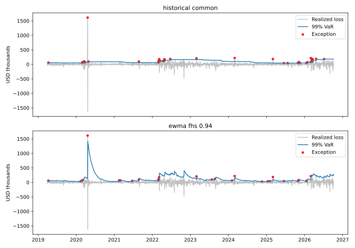

# Risk in a refiner’s 3-2-1 hedge book

**Volatility scaling cuts VaR exceptions from 2.16% to 1.43% and passes the 5% coverage test; exception clustering remains unresolved.** The baseline underestimates tail risk. The diagnosis separates volatility clustering from contract-selection problems, then tests EWMA filtered historical simulation (FHS) on the same forecast dates.

How much can a refiner’s financial hedge lose in one day, and which model responds best when volatility changes?

## What improved

All four models below use **1,894 matching forecasts, March 29, 2019–October 7, 2026**, with a 250-observation estimation window and a 99% VaR target. The dollar column is the average forecast VaR over those dates.

| Method | Average 99% one-day VaR | Exceptions | Exception rate | Coverage p | Independence p |
|---|---:|---:|---:|---:|---:|
| Historical | $91,609 | 41 | 2.16% | 0.000010 | <0.000001 |
| Normal | $124,398 | 43 | 2.27% | 0.000002 | <0.000001 |
| Weighted historical, decay 0.97 | $122,219 | 39 | 2.06% | 0.000050 | 0.0521 |
| **EWMA FHS, decay 0.94** | **$121,020** | **27** | **1.43%** | **0.0802** | **0.0058** |

FHS passes unconditional coverage at the 5% threshold: the test does not reject the nominal 1% exception rate. It still fails independence and joint conditional coverage. Average VaR rises by about 32%, showing the cost of recognizing more risk. Excluding possible month-turn rolls from training worsens coverage, so those observations are retained.



[Diagnosis and April 20, 2020](docs/backtest_diagnosis.md) · [Full model comparison](outputs/diagnosis_2026-10/model_comparison.csv) · [Exception ledger](outputs/diagnosis_2026-10/exception_ledger.csv)

## The book

A refiner buys crude and sells products, so the financial margin hedge is **long crude and short products**. A hedge loss can offset a gain in the physical margin.

| Position | Contracts | Physical units |
|---|---:|---:|
| WTI crude (CL) | +30 | +30,000 bbl |
| RBOB gasoline (RB) | -20 | -840,000 gal = -20,000 bbl |
| Heating oil / distillate proxy (HO) | -10 | -420,000 gal = -10,000 bbl |

This represents the financial hedge of a stylized 30,000-barrel crude input yielding 20,000 barrels of gasoline and 10,000 barrels of distillate. The saved product-rally stress loses about $931,652 on the hedge while the matched physical margin gains.

## Saved evidence

The [October 2026 snapshot](outputs/sample_run_2026-10/README.md) contains 2,205 aligned Yahoo proxy prices through October 7, along with configuration, environment, checksums, point-in-time VaR/ES and stress results. Its original historical backtest has 42 exceptions in 1,954 forecasts (2.15%); the comparison above uses fewer dates because FHS needs a volatility warmup.

The [dated-contract study](docs/continuous_series.md) audits 48 Yahoo tickers and reconciles 250 real long-dated P&L intervals to the contract held. Roll adjustment lowers P&L volatility slightly; its reported 99% VaR is unchanged.

[Snapshot VaR/ES and stress results](outputs/sample_run_2026-10/executive_summary.md) · [Real-contract results](outputs/real_contract_roll_2026-10/comparison.csv)

## Models

- Historical, Normal, Student-t Monte Carlo, weighted historical and EWMA filtered historical VaR/ES.
- Component VaR, hypothetical stress, worst historical fixed-book days and an illustrative risk limit.
- Prior-only rolling forecasts with coverage and independence diagnostics.
- A contract-panel continuous-series builder with held-contract P&L reconciliation.
- A separate WTI producer option case study using European Black-76 full revaluation.

[Refiner thesis and signs](docs/refiner_hedge.md) · [Contract rolls](docs/continuous_series.md) · [Option risk](docs/nonlinear_risk.md)

## Run it

```bash
pip install -r requirements.txt
pytest
python run_diagnostics.py
python run_real_contract_roll.py
```

Replay the saved prices or fetch a new public-data sample:

```bash
python run_analysis.py --mode snapshot --prices outputs/sample_run_2026-10/input_prices.csv --output-dir outputs/replay
python run_analysis.py --mode live --end 2026-10-08 --output-dir outputs/sample_run_2026-10
```

For an exact replay, use the configuration saved with the sample. Live mode fails on download errors. The offline demonstrations use labeled synthetic inputs:

```bash
python run_analysis.py --mode demo --output-dir outputs/demo
python run_option_risk.py
python run_roll_analysis.py --settlements examples/roll_fixture/settlements.csv --schedule examples/roll_fixture/schedule.csv --data-label "SYNTHETIC contract fixture" --output-dir outputs/roll_fixture
```

## What I learned / what I would do differently

Position signs and contract units come first. The next question is what the price history actually represents: April 2020 shows why contract selection matters, and the backtest shows why volatility scaling matters. They require different fixes.

I would obtain expired-contract settlements and specify the refiner’s roll policy, then monitor the fixed FHS model on new observations. For options, the next inputs are observed volatility surfaces and physical basis factors.

The project's data, model and validation boundaries are collected in [Limitations](docs/limitations.md).
